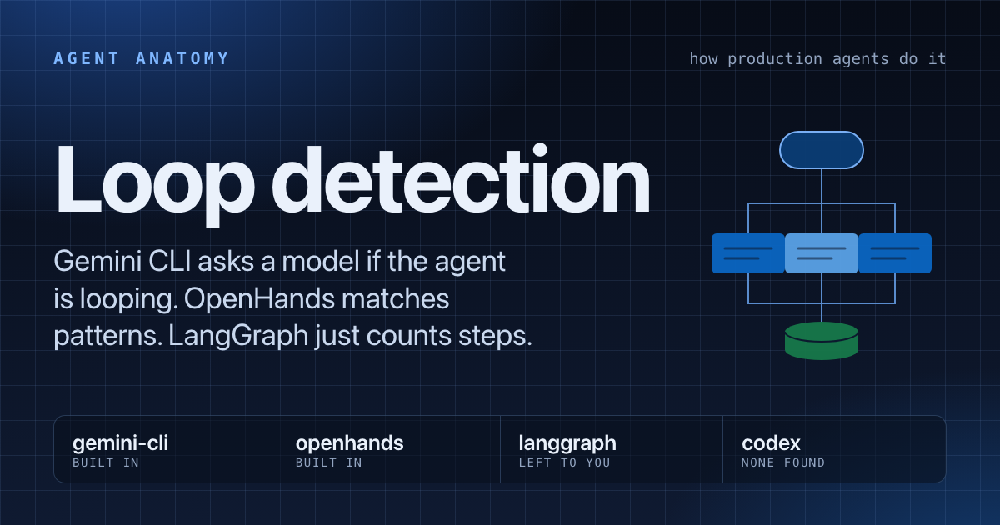
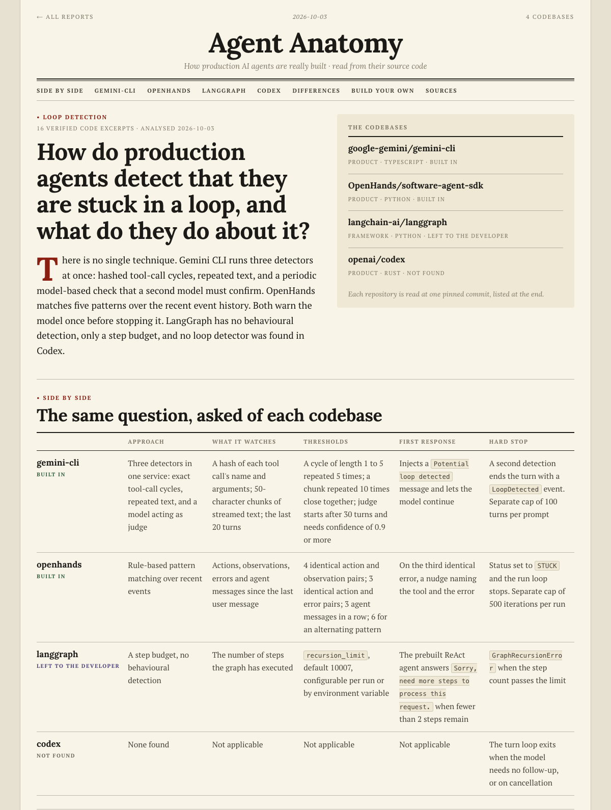
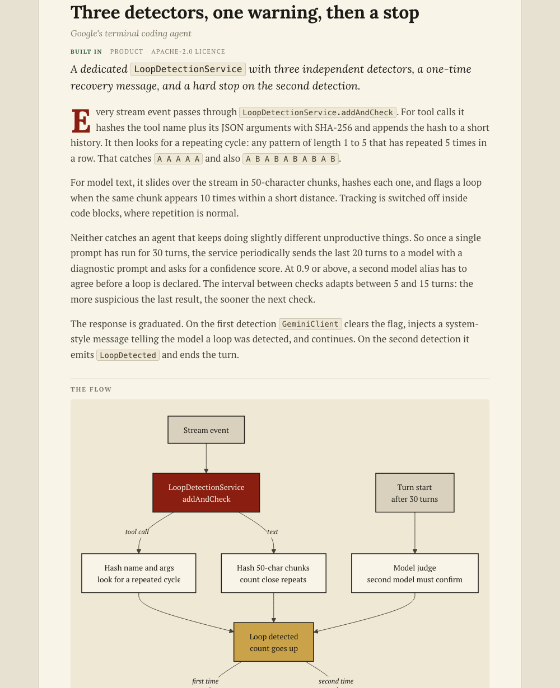
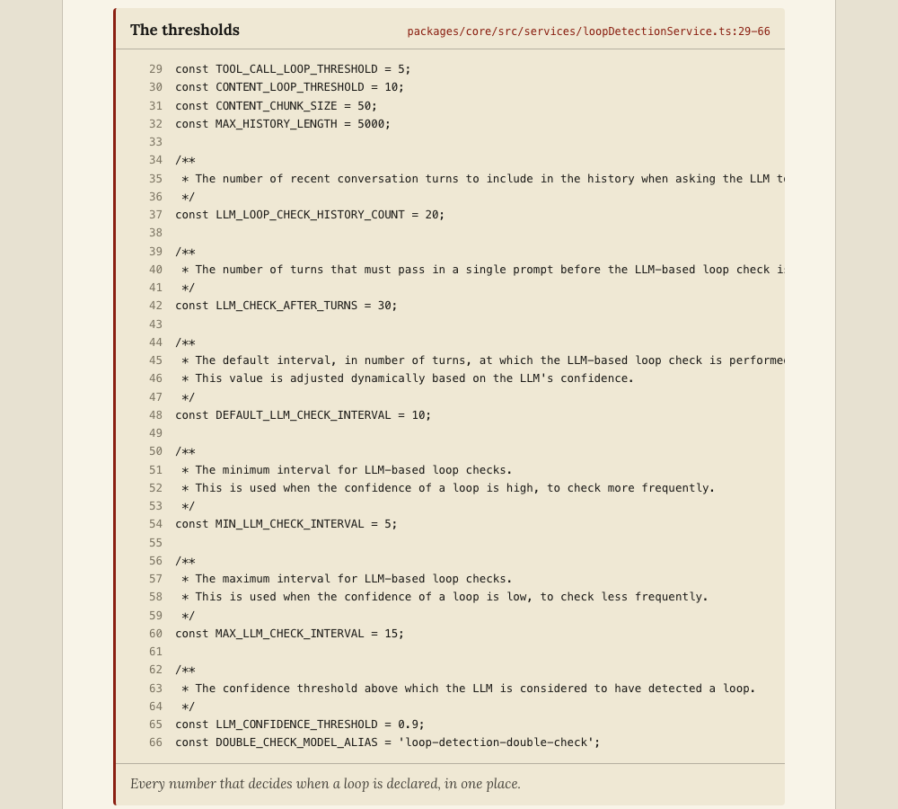

# agent-anatomy

**How production AI agents are really built, read from their source code.**

A [Claude Code](https://claude.com/claude-code) plugin. Ask one pinpoint question about an agent technique. It finds the implementing code in real agent codebases, explains it, compares the approaches, and writes an HTML report with the actual code.

[](https://antriksh29071989.github.io/agent-anatomy/reports/loop-detection/)

**[Live example: how do agents detect they are stuck in a loop? →](https://antriksh29071989.github.io/agent-anatomy/reports/loop-detection/)**

More reports: [how Gemini CLI compresses chat history](https://antriksh29071989.github.io/agent-anatomy/reports/chat-compression/) · [all reports](https://antriksh29071989.github.io/agent-anatomy/)

## Why

Tutorials say "compress the context by summarising old messages" or "detect loops by counting repeated tool calls". That is the textbook answer. The production answer is in the details: what triggers it, what the thresholds are, what happens when it fails, and whether the model gets a warning first. Those details are sitting in open-source code that few people read.

## Quick start

In Claude Code:

```
/plugin marketplace add Antriksh29071989/agent-anatomy
/plugin install agent-anatomy@agent-anatomy
```

Then ask:

```
/agent-anatomy:ask how do agents detect that they are stuck in a loop?
```

Name the repositories if you want specific ones:

```
/agent-anatomy:ask how is chat history compressed? in gemini-cli codex cline
/agent-anatomy:ask how are tool errors fed back to the model? in langchain-ai/langgraph openai/openai-agents-python
```

One repository is fine too: you get the same deep dive without the comparison.

```
/agent-anatomy:ask how is chat history compressed? in gemini-cli
```

Run it with no question to get a menu of topics.

## What you get

`reports/<topic>/index.html`, one self-contained page.

### A direct answer and a side-by-side summary

Each repository gets a verdict (built in, partly, left to the developer, or not found) and the same set of concrete facts.



### A deep dive per repository

How the mechanism works, a flow diagram, and the key classes with links.



### The actual code

Short excerpts with line numbers, each linked to the exact lines at a pinned commit.



### A working version you can run

Each report ends with a small implementation of the technique, written to follow the original design: one Python file and its tests, standard library only. A table maps each behaviour in the code to the lines of the original it mirrors, and a list says what was left out.

```
curl -O https://antriksh29071989.github.io/agent-anatomy/reports/loop-detection/impl/loop_detector.py
curl -O https://antriksh29071989.github.io/agent-anatomy/reports/loop-detection/impl/test_loop_detector.py
python3 -m unittest -v
```

| Technique | Follows | Code | Tests |
|---|---|---|---|
| Loop detection | Gemini CLI's call-cycle detector and warn-then-stop response; OpenHands' same-result and error-streak rules | [loop_detector.py](reports/loop-detection/impl/loop_detector.py) | [11](reports/loop-detection/impl/test_loop_detector.py) |
| Chat compression | Gemini CLI's threshold, tool-output budget, safe split, snapshot, self-critique and size guard | [chat_compressor.py](reports/chat-compression/impl/chat_compressor.py) | [17](reports/chat-compression/impl/test_chat_compressor.py) |

Then: where the approaches differ and why, and a "build your own" list. Each report also gets a 1200×630 share card and link-preview tags.

## How a report earns trust

**The code cannot be misquoted.** The model never writes code into the report. It writes a file path, a line range, and a string it expects to find there. The build script reads those lines from the repository at the pinned commit, and fails if the commit, path, range or expected string does not match.

**Every fact is cited.** Each statement about the code carries a small numbered link to the exact lines that support it, and the page ends with an evidence list: every claim, and where to check it. The build rejects a report whose summaries, comparison cells or explanations state facts without a citation.

**A second agent tries to disprove it.** Before a report can be built for publishing, a separate reviewer agent with a fresh context reads each claim next to the cited lines and marks it supported, partial, unsupported or unclear. It also flags factual sentences that have no citation. The build refuses to publish unless every claim is supported, and any later edit to a claim or to the text invalidates the review.

**The working code is held to the same standard.** The build runs its tests and refuses to publish if they fail. Each behaviour the code reproduces is mapped to a reviewed citation, and the reviewer checks that the code does what the original does: the same thresholds, comparisons and order. Anything left out has to be declared.

What this does not do: the reviewer is another AI pass, not a proof. It catches claims that say more than the code shows; it can still miss things. Follow a citation before you rely on a claim.

## Topics it is built for

| | |
|---|---|
| Context compression | Loop detection |
| Memory | Tool errors and retries |
| Tool output handling | Prompt assembly |
| Sub-agents | Approvals and sandboxing |
| Stopping conditions | Model fallback and retries |
| Prompt caching | Evals |
| Checkpointing and resume | Streaming and cancellation |

Any specific question about how an agent works is fair game; these are the ones with [search terms prepared](plugins/agent-anatomy/skills/ask/references/topics.md).

## Default repositories

If you name none, three or four are chosen from this list to suit the question.

| Products | Frameworks |
|---|---|
| [google-gemini/gemini-cli](https://github.com/google-gemini/gemini-cli) | [langchain-ai/langgraph](https://github.com/langchain-ai/langgraph) |
| [openai/codex](https://github.com/openai/codex) | [langchain-ai/deepagents](https://github.com/langchain-ai/deepagents) |
| [OpenHands/software-agent-sdk](https://github.com/OpenHands/software-agent-sdk) | [openai/openai-agents-python](https://github.com/openai/openai-agents-python) |
| [cline/cline](https://github.com/cline/cline) | [google/adk-python](https://github.com/google/adk-python) |
| [anomalyco/opencode](https://github.com/anomalyco/opencode) | [pydantic/pydantic-ai](https://github.com/pydantic/pydantic-ai) |
| [aaif-goose/goose](https://github.com/aaif-goose/goose) | [huggingface/smolagents](https://github.com/huggingface/smolagents) |
| [Aider-AI/aider](https://github.com/Aider-AI/aider) | [crewAIInc/crewAI](https://github.com/crewAIInc/crewAI) |

All are MIT or Apache-2.0 licensed ([registry](plugins/agent-anatomy/skills/ask/references/repos.json), checked 2026-10-03). Any other public repository, or a local path, works too.

## How it works

1. **Fetch.** [`fetch.py`](plugins/agent-anatomy/skills/ask/scripts/fetch.py) clones each repository at depth 1 into `~/.cache/agent-anatomy` and reports the pinned commit. The cache is reused across questions.
2. **Find.** Claude searches by every name the technique goes by, reads the candidates, and traces the mechanism from trigger to effect.
3. **Explain, compare and cite.** It writes `report.json`: the answer, verdicts, comparison rows, deep dives, diagrams, excerpt line ranges, and a citation for every fact ([schema](plugins/agent-anatomy/skills/ask/references/report-schema.md)).
4. **Implement.** It writes a small tested implementation that follows the original design, and maps each behaviour to its citation.
5. **Review.** The [`claim-reviewer`](plugins/agent-anatomy/agents/claim-reviewer.md) agent checks each claim, and each piece of the implementation, against the source via [`review.py`](plugins/agent-anatomy/skills/ask/scripts/review.py) and records its verdicts.
6. **Verify and render.** [`build.py`](plugins/agent-anatomy/skills/ask/scripts/build.py) checks every commit, path and line range, requires a passing review, pulls the code, and fills the [template](plugins/agent-anatomy/skills/ask/assets/template.html).

## Limits

- **"Not found" is not "does not exist".** A verdict of not found means nothing turned up in what was searched; the report lists the search terms and where it looked.
- **These projects change weekly.** A report describes one commit per repository, shown at the bottom of the page.
- **Behaviour is read, not run.** Nothing is executed.
- **Products and frameworks answer differently.** A framework leaving something to you is a design choice, not a gap; reports label which kind each repository is.
- Diagrams load a renderer from a CDN, so they need a connection the first time the page opens.

Requires `git` and `python3`. The share card needs Chrome, Chromium, Edge or Brave.

## Developing

```
claude --plugin-dir ./plugins/agent-anatomy    # run from a local clone
claude plugin validate .                       # after changing a manifest
```

Re-render a report after editing it by hand:

```
python3 plugins/agent-anatomy/skills/ask/scripts/build.py reports/<topic>/report.json reports/<topic>/index.html
```

Excerpts belong to their authors under each repository's licence. Related: [claude-plugins](https://github.com/Antriksh29071989/claude-plugins), with an architecture X-ray and a tech-debt hotspot map for any repository.
